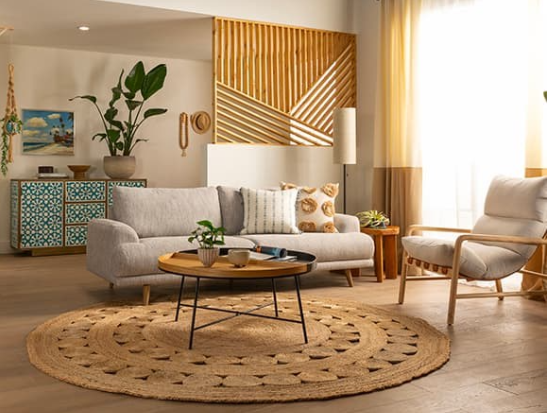
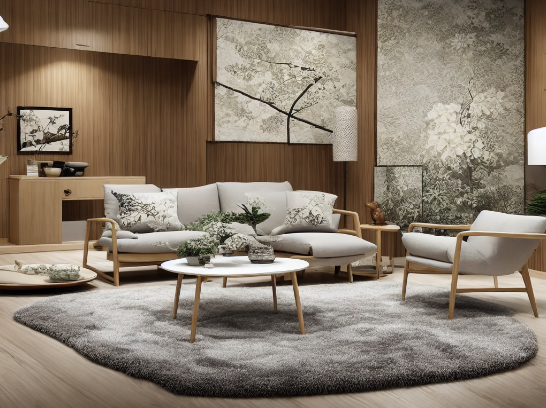

# controlnet-room-designer
Changing room interior via prompt according to base input image

## Explanation

There are many preprocessor that can be used within ControlNet model such as MLSD, Depth, CannyEdge and so on. In this project, for protecting edges of furnitures, MLSD preprocessor has been used inside ControlNet model. 

### Setup
---
- Build a docker image
`docker build -t myimage .`

- Install Client Requirements
`pip install -r client_requirements.txt`

---
### Usage
- Run Docker Server
`docker run --gpus all -p 80:80 -it myimage:latest`

- Run Client Application
`python client_side.py`

---
## Model Outputs 

- Input Image

- Prompt -> `a japanese style living room`

- Output Image

